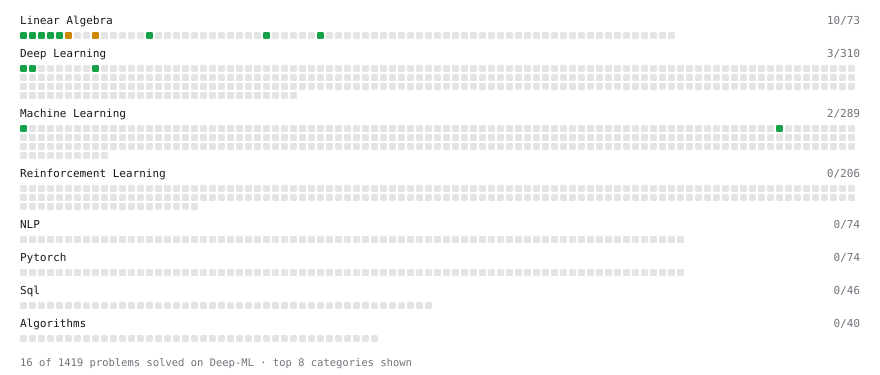

# Deep-ML

My machine learning practice from [Deep-ML](https://www.deep-ml.com). Every solution here was written by hand.

**66** solved · 66 problems · 0 labs · 0 math

[**Browse the interactive portfolio**](https://PARTHIBAN-007.github.io/deep-ml/) to replay this filling in over time.

## Problems

| | Difficulty | Solved | |
| --- | --- | --- | --- |
| [Binary Classification with Logistic Regression](https://www.deep-ml.com/problems/104) | easy | 2026-05-21 | [solution](problems/0104-binary-classification-with-logistic-regression) |
| [Calculate 2x2 Matrix Inverse](https://www.deep-ml.com/problems/8) | easy | 2026-05-04 | [solution](problems/0008-calculate-2x2-matrix-inverse) |
| [Calculate Accuracy Score](https://www.deep-ml.com/problems/36) | easy | 2026-05-15 | [solution](problems/0036-calculate-accuracy-score) |
| [Calculate Cosine Similarity Between Vectors](https://www.deep-ml.com/problems/76) | easy | 2026-04-30 | [solution](problems/0076-calculate-cosine-similarity-between-vectors) |
| [Calculate Covariance Matrix](https://www.deep-ml.com/problems/10) | easy | 2026-05-05 | [solution](problems/0010-calculate-covariance-matrix) |
| [Calculate Mean Absolute Error (MAE)](https://www.deep-ml.com/problems/93) | easy | 2026-05-15 | [solution](problems/0093-calculate-mean-absolute-error-mae) |
| [Calculate Mean by Row or Column](https://www.deep-ml.com/problems/4) | easy | 2026-04-24 | [solution](problems/0004-calculate-mean-by-row-or-column) |
| [Calculate P50/P95/P99 Latency Percentiles](https://www.deep-ml.com/problems/293) | easy | 2026-05-01 | [solution](problems/0293-calculate-p50-p95-p99-latency-percentiles) |
| [Calculate R-squared for Regression Analysis](https://www.deep-ml.com/problems/69) | easy | 2026-05-16 | [solution](problems/0069-calculate-r-squared-for-regression-analysis) |
| [Calculate Root Mean Square Error (RMSE)](https://www.deep-ml.com/problems/71) | easy | 2026-05-15 | [solution](problems/0071-calculate-root-mean-square-error-rmse) |
| [Compute Multi-class Cross-Entropy Loss](https://www.deep-ml.com/problems/134) | easy | 2026-05-11 | [solution](problems/0134-compute-multi-class-cross-entropy-loss) |
| [Compute the Cross Product of Two 3D Vectors](https://www.deep-ml.com/problems/118) | easy | 2026-04-30 | [solution](problems/0118-compute-the-cross-product-of-two-3d-vectors) |
| [Convert Vector to Diagonal Matrix](https://www.deep-ml.com/problems/35) | easy | 2026-04-25 | [solution](problems/0035-convert-vector-to-diagonal-matrix) |
| [Derivative of a Polynomial](https://www.deep-ml.com/problems/116) | easy | 2026-04-24 | [solution](problems/0116-derivative-of-a-polynomial) |
| [Descriptive Statistics Calculator](https://www.deep-ml.com/problems/78) | easy | 2026-05-01 | [solution](problems/0078-descriptive-statistics-calculator) |
| [Dot Product Calculator](https://www.deep-ml.com/problems/83) | easy | 2026-04-24 | [solution](problems/0083-dot-product-calculator) |
| [Expected Value and Variance of an n-Sided Die](https://www.deep-ml.com/problems/179) | easy | 2026-05-06 | [solution](problems/0179-expected-value-and-variance-of-an-n-sided-die) |
| [Feature Scaling Implementation](https://www.deep-ml.com/problems/16) | easy | 2026-05-12 | [solution](problems/0016-feature-scaling-implementation) |
| [GeLU Activation Function ](https://www.deep-ml.com/problems/147) | easy | 2026-05-21 | [solution](problems/0147-gelu-activation-function) |
| [Generate a Confusion Matrix for Binary Classification](https://www.deep-ml.com/problems/75) | easy | 2026-05-15 | [solution](problems/0075-generate-a-confusion-matrix-for-binary-classification) |
| [Gradient Direction and Magnitude](https://www.deep-ml.com/problems/308) | easy | 2026-04-24 | [solution](problems/0308-gradient-direction-and-magnitude) |
| [Implement F-Score Calculation for Binary Classification](https://www.deep-ml.com/problems/61) | easy | 2026-05-15 | [solution](problems/0061-implement-f-score-calculation-for-binary-classification) |
| [Implement Precision Metric](https://www.deep-ml.com/problems/46) | easy | 2026-05-15 | [solution](problems/0046-implement-precision-metric) |
| [Implement Recall Metric in Binary Classification](https://www.deep-ml.com/problems/52) | easy | 2026-05-15 | [solution](problems/0052-implement-recall-metric-in-binary-classification) |
| [Implement ReLU Activation Function](https://www.deep-ml.com/problems/42) | easy | 2026-04-23 | [solution](problems/0042-implement-relu-activation-function) |
| [Implement RMSNorm (Root Mean Square Layer Normalization)](https://www.deep-ml.com/problems/372) | easy | 2026-05-21 | [solution](problems/0372-implement-rmsnorm-root-mean-square-layer-normalization) |
| [Implement SwiGLU activation function](https://www.deep-ml.com/problems/156) | easy | 2026-05-21 | [solution](problems/0156-implement-swiglu-activation-function) |
| [Implement the Swish Activation Function](https://www.deep-ml.com/problems/102) | easy | 2026-05-21 | [solution](problems/0102-implement-the-swish-activation-function) |
| [Implementation of Log Softmax Function](https://www.deep-ml.com/problems/39) | easy | 2026-05-16 | [solution](problems/0039-implementation-of-log-softmax-function) |
| [Leaky ReLU Activation Function](https://www.deep-ml.com/problems/44) | easy | 2026-05-03 | [solution](problems/0044-leaky-relu-activation-function) |
| [Linear Regression Using Gradient Descent](https://www.deep-ml.com/problems/15) | easy | 2026-05-08 | [solution](problems/0015-linear-regression-using-gradient-descent) |
| [Linear Regression Using Normal Equation](https://www.deep-ml.com/problems/14) | easy | 2026-04-29 | [solution](problems/0014-linear-regression-using-normal-equation) |
| [Matrix Determinant & Trace](https://www.deep-ml.com/problems/195) | easy | 2026-04-26 | [solution](problems/0195-matrix-determinant-trace) |
| [Matrix-Vector Dot Product](https://www.deep-ml.com/problems/1) | easy | 2026-04-23 | [solution](problems/0001-matrix-vector-dot-product) |
| [Min-Max Scaling of Feature Values](https://www.deep-ml.com/problems/112) | easy | 2026-05-07 | [solution](problems/0112-min-max-scaling-of-feature-values) |
| [One-Hot Encoding of Nominal Values](https://www.deep-ml.com/problems/34) | easy | 2026-05-13 | [solution](problems/0034-one-hot-encoding-of-nominal-values) |
| [Poisson Distribution Probability Calculator](https://www.deep-ml.com/problems/81) | easy | 2026-05-21 | [solution](problems/0081-poisson-distribution-probability-calculator) |
| [Reshape Matrix](https://www.deep-ml.com/problems/3) | easy | 2026-04-24 | [solution](problems/0003-reshape-matrix) |
| [Scalar Multiplication of a Matrix](https://www.deep-ml.com/problems/5) | easy | 2026-04-25 | [solution](problems/0005-scalar-multiplication-of-a-matrix) |
| [Sigmoid Activation Function Understanding](https://www.deep-ml.com/problems/22) | easy | 2026-04-24 | [solution](problems/0022-sigmoid-activation-function-understanding) |
| [Single Neuron](https://www.deep-ml.com/problems/24) | easy | 2026-05-25 | [solution](problems/0024-single-neuron) |
| [Softmax Activation Function Implementation ](https://www.deep-ml.com/problems/23) | easy | 2026-04-23 | [solution](problems/0023-softmax-activation-function-implementation) |
| [Transpose of a Matrix](https://www.deep-ml.com/problems/2) | easy | 2026-04-24 | [solution](problems/0002-transpose-of-a-matrix) |
| [Vector Element-wise Sum](https://www.deep-ml.com/problems/121) | easy | 2026-04-30 | [solution](problems/0121-vector-element-wise-sum) |
| [Adam Optimizer](https://www.deep-ml.com/problems/87) | medium | 2026-05-28 | [solution](problems/0087-adam-optimizer) |
| [Binomial Distribution Probability](https://www.deep-ml.com/problems/79) | medium | 2026-05-25 | [solution](problems/0079-binomial-distribution-probability) |
| [Build Scaled Dot-Product Attention](https://www.deep-ml.com/problems/490) | medium | 2026-05-19 | [solution](problems/0490-build-scaled-dot-product-attention) |
| [Calculate Eigenvalues of a Matrix](https://www.deep-ml.com/problems/6) | medium | 2026-04-27 | [solution](problems/0006-calculate-eigenvalues-of-a-matrix) |
| [Calculate Performance Metrics for a Classification Model](https://www.deep-ml.com/problems/77) | medium | 2026-05-16 | [solution](problems/0077-calculate-performance-metrics-for-a-classification-model) |
| [Handle Missing Data with Imputation](https://www.deep-ml.com/problems/354) | medium | 2026-05-14 | [solution](problems/0354-handle-missing-data-with-imputation) |
| [Implement Adam Optimization Algorithm](https://www.deep-ml.com/problems/49) | medium | 2026-05-26 | [solution](problems/0049-implement-adam-optimization-algorithm) |
| [Implement Grouped Query Attention (GQA)](https://www.deep-ml.com/problems/391) | medium | 2026-05-23 | [solution](problems/0391-implement-grouped-query-attention-gqa) |
| [Implement K-Fold Cross-Validation](https://www.deep-ml.com/problems/18) | medium | 2026-05-16 | [solution](problems/0018-implement-k-fold-cross-validation) |
| [Implement Layer Normalization for Sequence Data](https://www.deep-ml.com/problems/109) | medium | 2026-05-20 | [solution](problems/0109-implement-layer-normalization-for-sequence-data) |
| [Implement Masked Self-Attention](https://www.deep-ml.com/problems/107) | medium | 2026-05-20 | [solution](problems/0107-implement-masked-self-attention) |
| [Implement Multiquery Attention (MQA)](https://www.deep-ml.com/problems/390) | medium | 2026-05-22 | [solution](problems/0390-implement-multiquery-attention-mqa) |
| [Implement Self-Attention Mechanism](https://www.deep-ml.com/problems/53) | medium | 2026-05-02 | [solution](problems/0053-implement-self-attention-mechanism) |
| [LoRA: Low-Rank Adaptation Forward Pass](https://www.deep-ml.com/problems/222) | medium | 2026-05-18 | [solution](problems/0222-lora-low-rank-adaptation-forward-pass) |
| [Matrix times Matrix ](https://www.deep-ml.com/problems/9) | medium | 2026-04-28 | [solution](problems/0009-matrix-times-matrix) |
| [Matrix Transformation ](https://www.deep-ml.com/problems/7) | medium | 2026-05-10 | [solution](problems/0007-matrix-transformation) |
| [Normal Distribution PDF Calculator](https://www.deep-ml.com/problems/80) | medium | 2026-05-25 | [solution](problems/0080-normal-distribution-pdf-calculator) |
| [Rotary Positional Embeddings (RoPE)](https://www.deep-ml.com/problems/381) | medium | 2026-05-24 | [solution](problems/0381-rotary-positional-embeddings-rope) |
| [Sliding Window Attention](https://www.deep-ml.com/problems/388) | medium | 2026-05-27 | [solution](problems/0388-sliding-window-attention) |
| [Solve Linear Equations using Jacobi Method](https://www.deep-ml.com/problems/11) | medium | 2026-05-17 | [solution](problems/0011-solve-linear-equations-using-jacobi-method) |
| [Implement Multi-Head Attention](https://www.deep-ml.com/problems/94) | hard | 2026-05-20 | [solution](problems/0094-implement-multi-head-attention) |
| [Positional Encoding Calculator](https://www.deep-ml.com/problems/85) | hard | 2026-05-20 | [solution](problems/0085-positional-encoding-calculator) |

---

_This file is regenerated by Deep-ML on every push._
