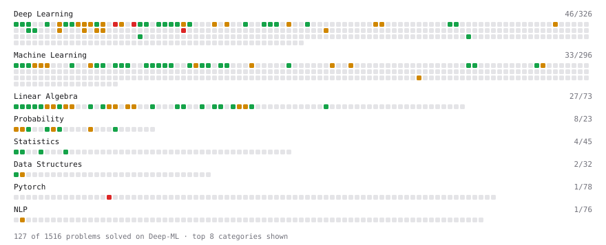

# Deep-ML

My machine learning practice from [Deep-ML](https://www.deep-ml.com). Every solution here was written by hand.

**132** solved · 132 problems · 0 labs · 0 math

[**Browse the interactive portfolio**](https://PARTHIBAN-007.github.io/deep-ml/) to replay this filling in over time.

## Problems

| | Difficulty | Solved | |
| --- | --- | --- | --- |
| [Adagrad Optimizer](https://www.deep-ml.com/problems/145) | easy | 2026-06-11 | [solution](problems/0145-adagrad-optimizer) |
| [Batch Iterator for Dataset](https://www.deep-ml.com/problems/30) | easy | 2026-06-19 | [solution](problems/0030-batch-iterator-for-dataset) |
| [Binary Classification with Logistic Regression](https://www.deep-ml.com/problems/104) | easy | 2026-05-21 | [solution](problems/0104-binary-classification-with-logistic-regression) |
| [Calculate 2x2 Matrix Inverse](https://www.deep-ml.com/problems/8) | easy | 2026-05-04 | [solution](problems/0008-calculate-2x2-matrix-inverse) |
| [Calculate Accuracy Score](https://www.deep-ml.com/problems/36) | easy | 2026-05-15 | [solution](problems/0036-calculate-accuracy-score) |
| [Calculate Conditional Probability from Data](https://www.deep-ml.com/problems/168) | easy | 2026-06-05 | [solution](problems/0168-calculate-conditional-probability-from-data) |
| [Calculate Cosine Similarity Between Vectors](https://www.deep-ml.com/problems/76) | easy | 2026-04-30 | [solution](problems/0076-calculate-cosine-similarity-between-vectors) |
| [Calculate Covariance Matrix](https://www.deep-ml.com/problems/10) | easy | 2026-05-05 | [solution](problems/0010-calculate-covariance-matrix) |
| [Calculate F1 Score from Predicted and True Labels](https://www.deep-ml.com/problems/91) | easy | 2026-06-01 | [solution](problems/0091-calculate-f1-score-from-predicted-and-true-labels) |
| [Calculate Image Brightness](https://www.deep-ml.com/problems/70) | easy | 2026-06-18 | [solution](problems/0070-calculate-image-brightness) |
| [Calculate Mean Absolute Error (MAE)](https://www.deep-ml.com/problems/93) | easy | 2026-05-15 | [solution](problems/0093-calculate-mean-absolute-error-mae) |
| [Calculate Mean by Row or Column](https://www.deep-ml.com/problems/4) | easy | 2026-04-24 | [solution](problems/0004-calculate-mean-by-row-or-column) |
| [Calculate P50/P95/P99 Latency Percentiles](https://www.deep-ml.com/problems/293) | easy | 2026-05-01 | [solution](problems/0293-calculate-p50-p95-p99-latency-percentiles) |
| [Calculate R-squared for Regression Analysis](https://www.deep-ml.com/problems/69) | easy | 2026-05-16 | [solution](problems/0069-calculate-r-squared-for-regression-analysis) |
| [Calculate Root Mean Square Error (RMSE)](https://www.deep-ml.com/problems/71) | easy | 2026-05-15 | [solution](problems/0071-calculate-root-mean-square-error-rmse) |
| [Calculate SVM Margin Width](https://www.deep-ml.com/problems/282) | easy | 2026-06-11 | [solution](problems/0282-calculate-svm-margin-width) |
| [Check Linear Independence of Vectors](https://www.deep-ml.com/problems/331) | easy | 2026-07-04 | [solution](problems/0331-check-linear-independence-of-vectors) |
| [Compute Multi-class Cross-Entropy Loss](https://www.deep-ml.com/problems/134) | easy | 2026-05-11 | [solution](problems/0134-compute-multi-class-cross-entropy-loss) |
| [Compute Posterior Probability using Bayes' Theorem](https://www.deep-ml.com/problems/336) | easy | 2026-06-06 | [solution](problems/0336-compute-posterior-probability-using-bayes-theorem) |
| [Compute the Cross Product of Two 3D Vectors](https://www.deep-ml.com/problems/118) | easy | 2026-04-30 | [solution](problems/0118-compute-the-cross-product-of-two-3d-vectors) |
| [Convert Vector to Diagonal Matrix](https://www.deep-ml.com/problems/35) | easy | 2026-04-25 | [solution](problems/0035-convert-vector-to-diagonal-matrix) |
| [Derivative of a Polynomial](https://www.deep-ml.com/problems/116) | easy | 2026-04-24 | [solution](problems/0116-derivative-of-a-polynomial) |
| [Descriptive Statistics Calculator](https://www.deep-ml.com/problems/78) | easy | 2026-05-01 | [solution](problems/0078-descriptive-statistics-calculator) |
| [Detect Overfitting or Underfitting](https://www.deep-ml.com/problems/86) | easy | 2026-06-10 | [solution](problems/0086-detect-overfitting-or-underfitting) |
| [Dot Product Calculator](https://www.deep-ml.com/problems/83) | easy | 2026-04-24 | [solution](problems/0083-dot-product-calculator) |
| [Empirical Probability Mass Function (PMF)](https://www.deep-ml.com/problems/184) | easy | 2026-06-03 | [solution](problems/0184-empirical-probability-mass-function-pmf) |
| [Expected Value and Variance of an n-Sided Die](https://www.deep-ml.com/problems/179) | easy | 2026-05-06 | [solution](problems/0179-expected-value-and-variance-of-an-n-sided-die) |
| [Feature Scaling Implementation](https://www.deep-ml.com/problems/16) | easy | 2026-05-12 | [solution](problems/0016-feature-scaling-implementation) |
| [GeLU Activation Function ](https://www.deep-ml.com/problems/147) | easy | 2026-05-21 | [solution](problems/0147-gelu-activation-function) |
| [Gemma-Style RMSNorm with Optional Scale](https://www.deep-ml.com/problems/1047) | easy | 2026-05-29 | [solution](problems/1047-gemma-style-rmsnorm-with-optional-scale) |
| [Generate a Confusion Matrix for Binary Classification](https://www.deep-ml.com/problems/75) | easy | 2026-05-15 | [solution](problems/0075-generate-a-confusion-matrix-for-binary-classification) |
| [Gradient Direction and Magnitude](https://www.deep-ml.com/problems/308) | easy | 2026-04-24 | [solution](problems/0308-gradient-direction-and-magnitude) |
| [Implement a Simple Residual Block with Shortcut Connection](https://www.deep-ml.com/problems/113) | easy | 2026-06-02 | [solution](problems/0113-implement-a-simple-residual-block-with-shortcut-connection) |
| [Implement Binary Cross-Entropy Loss](https://www.deep-ml.com/problems/263) | easy | 2026-06-11 | [solution](problems/0263-implement-binary-cross-entropy-loss) |
| [Implement F-Score Calculation for Binary Classification](https://www.deep-ml.com/problems/61) | easy | 2026-05-15 | [solution](problems/0061-implement-f-score-calculation-for-binary-classification) |
| [Implement Gini Impurity Calculation for a Set of Classes](https://www.deep-ml.com/problems/64) | easy | 2026-06-22 | [solution](problems/0064-implement-gini-impurity-calculation-for-a-set-of-classes) |
| [Implement Hinge Loss for SVM](https://www.deep-ml.com/problems/283) | easy | 2026-06-11 | [solution](problems/0283-implement-hinge-loss-for-svm) |
| [Implement Orthogonal Projection of a Vector onto a Line](https://www.deep-ml.com/problems/66) | easy | 2026-07-04 | [solution](problems/0066-implement-orthogonal-projection-of-a-vector-onto-a-line) |
| [Implement Precision Metric](https://www.deep-ml.com/problems/46) | easy | 2026-05-15 | [solution](problems/0046-implement-precision-metric) |
| [Implement Recall Metric in Binary Classification](https://www.deep-ml.com/problems/52) | easy | 2026-05-15 | [solution](problems/0052-implement-recall-metric-in-binary-classification) |
| [Implement ReLU Activation Function](https://www.deep-ml.com/problems/42) | easy | 2026-04-23 | [solution](problems/0042-implement-relu-activation-function) |
| [Implement Ridge Regression Loss Function](https://www.deep-ml.com/problems/43) | easy | 2026-06-09 | [solution](problems/0043-implement-ridge-regression-loss-function) |
| [Implement RMSNorm (Root Mean Square Layer Normalization)](https://www.deep-ml.com/problems/372) | easy | 2026-05-21 | [solution](problems/0372-implement-rmsnorm-root-mean-square-layer-normalization) |
| [Implement SwiGLU activation function](https://www.deep-ml.com/problems/156) | easy | 2026-05-21 | [solution](problems/0156-implement-swiglu-activation-function) |
| [Implement the ELU Activation Function](https://www.deep-ml.com/problems/97) | easy | 2026-06-11 | [solution](problems/0097-implement-the-elu-activation-function) |
| [Implement the Hard Sigmoid Activation Function](https://www.deep-ml.com/problems/96) | easy | 2026-06-24 | [solution](problems/0096-implement-the-hard-sigmoid-activation-function) |
| [Implement the SELU Activation Function](https://www.deep-ml.com/problems/103) | easy | 2026-06-23 | [solution](problems/0103-implement-the-selu-activation-function) |
| [Implement the Softplus Activation Function](https://www.deep-ml.com/problems/99) | easy | 2026-06-11 | [solution](problems/0099-implement-the-softplus-activation-function) |
| [Implement the Softsign Activation Function](https://www.deep-ml.com/problems/100) | easy | 2026-06-20 | [solution](problems/0100-implement-the-softsign-activation-function) |
| [Implement the Square ReLU Activation Function](https://www.deep-ml.com/problems/373) | easy | 2026-06-25 | [solution](problems/0373-implement-the-square-relu-activation-function) |
| [Implement the Swish Activation Function](https://www.deep-ml.com/problems/102) | easy | 2026-05-21 | [solution](problems/0102-implement-the-swish-activation-function) |
| [Implement the Tanh Activation Function](https://www.deep-ml.com/problems/264) | easy | 2026-05-31 | [solution](problems/0264-implement-the-tanh-activation-function) |
| [Implementation of Log Softmax Function](https://www.deep-ml.com/problems/39) | easy | 2026-05-16 | [solution](problems/0039-implementation-of-log-softmax-function) |
| [KL Divergence Between Two Normal Distributions](https://www.deep-ml.com/problems/56) | easy | 2026-06-11 | [solution](problems/0056-kl-divergence-between-two-normal-distributions) |
| [L2 Normalization Along an Axis](https://www.deep-ml.com/problems/1022) | easy | 2026-07-02 | [solution](problems/1022-l2-normalization-along-an-axis) |
| [Leaky ReLU Activation Function](https://www.deep-ml.com/problems/44) | easy | 2026-05-03 | [solution](problems/0044-leaky-relu-activation-function) |
| [Linear Kernel Function](https://www.deep-ml.com/problems/45) | easy | 2026-06-10 | [solution](problems/0045-linear-kernel-function) |
| [Linear Regression Using Gradient Descent](https://www.deep-ml.com/problems/15) | easy | 2026-05-08 | [solution](problems/0015-linear-regression-using-gradient-descent) |
| [Linear Regression Using Normal Equation](https://www.deep-ml.com/problems/14) | easy | 2026-04-29 | [solution](problems/0014-linear-regression-using-normal-equation) |
| [Matrix Determinant & Trace](https://www.deep-ml.com/problems/195) | easy | 2026-04-26 | [solution](problems/0195-matrix-determinant-trace) |
| [Matrix-Vector Dot Product](https://www.deep-ml.com/problems/1) | easy | 2026-04-23 | [solution](problems/0001-matrix-vector-dot-product) |
| [Min-Max Scaling of Feature Values](https://www.deep-ml.com/problems/112) | easy | 2026-05-07 | [solution](problems/0112-min-max-scaling-of-feature-values) |
| [Momentum Optimizer](https://www.deep-ml.com/problems/146) | easy | 2026-06-11 | [solution](problems/0146-momentum-optimizer) |
| [One-Hot Encoding of Nominal Values](https://www.deep-ml.com/problems/34) | easy | 2026-05-13 | [solution](problems/0034-one-hot-encoding-of-nominal-values) |
| [Poisson Distribution Probability Calculator](https://www.deep-ml.com/problems/81) | easy | 2026-05-21 | [solution](problems/0081-poisson-distribution-probability-calculator) |
| [Reshape Matrix](https://www.deep-ml.com/problems/3) | easy | 2026-04-24 | [solution](problems/0003-reshape-matrix) |
| [Scalar Multiplication of a Matrix](https://www.deep-ml.com/problems/5) | easy | 2026-04-25 | [solution](problems/0005-scalar-multiplication-of-a-matrix) |
| [Shift and Scale Array to Target Range](https://www.deep-ml.com/problems/141) | easy | 2026-06-21 | [solution](problems/0141-shift-and-scale-array-to-target-range) |
| [Sigmoid Activation Function Understanding](https://www.deep-ml.com/problems/22) | easy | 2026-04-24 | [solution](problems/0022-sigmoid-activation-function-understanding) |
| [Single Neuron](https://www.deep-ml.com/problems/24) | easy | 2026-05-25 | [solution](problems/0024-single-neuron) |
| [Softmax Activation Function Implementation ](https://www.deep-ml.com/problems/23) | easy | 2026-04-23 | [solution](problems/0023-softmax-activation-function-implementation) |
| [Token Embedding Lookup Table](https://www.deep-ml.com/problems/945) | easy | 2026-06-17 | [solution](problems/0945-token-embedding-lookup-table) |
| [Transformation Matrix from Basis B to C](https://www.deep-ml.com/problems/27) | easy | 2026-06-13 | [solution](problems/0027-transformation-matrix-from-basis-b-to-c) |
| [Transpose of a Matrix](https://www.deep-ml.com/problems/2) | easy | 2026-04-24 | [solution](problems/0002-transpose-of-a-matrix) |
| [Vector Element-wise Sum](https://www.deep-ml.com/problems/121) | easy | 2026-04-30 | [solution](problems/0121-vector-element-wise-sum) |
| [Vector Norms (L1/L2/L-inf) and the Frobenius Norm](https://www.deep-ml.com/problems/328) | easy | 2026-06-04 | [solution](problems/0328-vector-norms-l1-l2-l-inf-and-the-frobenius-norm) |
| [Adadelta Optimizer](https://www.deep-ml.com/problems/149) | medium | 2026-06-27 | [solution](problems/0149-adadelta-optimizer) |
| [Adam Optimizer](https://www.deep-ml.com/problems/87) | medium | 2026-05-28 | [solution](problems/0087-adam-optimizer) |
| [Binomial Distribution Probability](https://www.deep-ml.com/problems/79) | medium | 2026-05-25 | [solution](problems/0079-binomial-distribution-probability) |
| [Build Scaled Dot-Product Attention](https://www.deep-ml.com/problems/490) | medium | 2026-05-19 | [solution](problems/0490-build-scaled-dot-product-attention) |
| [Calculate Correlation Matrix](https://www.deep-ml.com/problems/37) | medium | 2026-06-12 | [solution](problems/0037-calculate-correlation-matrix) |
| [Calculate Eigenvalues of a Matrix](https://www.deep-ml.com/problems/6) | medium | 2026-04-27 | [solution](problems/0006-calculate-eigenvalues-of-a-matrix) |
| [Calculate Performance Metrics for a Classification Model](https://www.deep-ml.com/problems/77) | medium | 2026-05-16 | [solution](problems/0077-calculate-performance-metrics-for-a-classification-model) |
| [Check if Matrix is Positive Definite](https://www.deep-ml.com/problems/332) | medium | 2026-07-09 | [solution](problems/0332-check-if-matrix-is-positive-definite) |
| [Chi-square Probability Distribution](https://www.deep-ml.com/problems/176) | medium | 2026-06-14 | [solution](problems/0176-chi-square-probability-distribution) |
| [Compute Orthonormal Basis for 2D Vectors](https://www.deep-ml.com/problems/117) | medium | 2026-07-08 | [solution](problems/0117-compute-orthonormal-basis-for-2d-vectors) |
| [Compute the Null Space (Kernel) of a Matrix](https://www.deep-ml.com/problems/330) | medium | 2026-07-01 | [solution](problems/0330-compute-the-null-space-kernel-of-a-matrix) |
| [Compute Total Probability using Law of Total Probability](https://www.deep-ml.com/problems/244) | medium | 2026-06-05 | [solution](problems/0244-compute-total-probability-using-law-of-total-probability) |
| [Count Trainable Parameters with Weight Tying in a GPT Model](https://www.deep-ml.com/problems/1009) | medium | 2026-06-17 | [solution](problems/1009-count-trainable-parameters-with-weight-tying-in-a-gpt-model) |
| [Engram Context-Aware Gating](https://www.deep-ml.com/problems/327) | medium | 2026-06-07 | [solution](problems/0327-engram-context-aware-gating) |
| [Gauss-Seidel Method for Solving Linear Systems](https://www.deep-ml.com/problems/57) | medium | 2026-07-07 | [solution](problems/0057-gauss-seidel-method-for-solving-linear-systems) |
| [Gaussian Elimination for Solving Linear Systems](https://www.deep-ml.com/problems/58) | medium | 2026-07-06 | [solution](problems/0058-gaussian-elimination-for-solving-linear-systems) |
| [Generate Random Subsets of a Dataset](https://www.deep-ml.com/problems/33) | medium | 2026-06-16 | [solution](problems/0033-generate-random-subsets-of-a-dataset) |
| [Handle Missing Data with Imputation](https://www.deep-ml.com/problems/354) | medium | 2026-05-14 | [solution](problems/0354-handle-missing-data-with-imputation) |
| [Implement Adam Optimization Algorithm](https://www.deep-ml.com/problems/49) | medium | 2026-05-26 | [solution](problems/0049-implement-adam-optimization-algorithm) |
| [Implement Group Normalization](https://www.deep-ml.com/problems/126) | medium | 2026-06-28 | [solution](problems/0126-implement-group-normalization) |
| [Implement Grouped Query Attention (GQA)](https://www.deep-ml.com/problems/391) | medium | 2026-05-23 | [solution](problems/0391-implement-grouped-query-attention-gqa) |
| [Implement K-Fold Cross-Validation](https://www.deep-ml.com/problems/18) | medium | 2026-05-16 | [solution](problems/0018-implement-k-fold-cross-validation) |
| [Implement K-Nearest Neighbors](https://www.deep-ml.com/problems/173) | medium | 2026-06-10 | [solution](problems/0173-implement-k-nearest-neighbors) |
| [Implement Layer Normalization for Sequence Data](https://www.deep-ml.com/problems/109) | medium | 2026-05-20 | [solution](problems/0109-implement-layer-normalization-for-sequence-data) |
| [Implement Long Short-Term Memory (LSTM) Network](https://www.deep-ml.com/problems/59) | medium | 2026-06-11 | [solution](problems/0059-implement-long-short-term-memory-lstm-network) |
| [Implement Masked Self-Attention](https://www.deep-ml.com/problems/107) | medium | 2026-05-20 | [solution](problems/0107-implement-masked-self-attention) |
| [Implement Multiquery Attention (MQA)](https://www.deep-ml.com/problems/390) | medium | 2026-05-22 | [solution](problems/0390-implement-multiquery-attention-mqa) |
| [Implement Reduced Row Echelon Form (RREF) Function](https://www.deep-ml.com/problems/48) | medium | 2026-07-03 | [solution](problems/0048-implement-reduced-row-echelon-form-rref-function) |
| [Implement RMSProp Optimizer](https://www.deep-ml.com/problems/200) | medium | 2026-06-11 | [solution](problems/0200-implement-rmsprop-optimizer) |
| [Implement Self-Attention Mechanism](https://www.deep-ml.com/problems/53) | medium | 2026-05-02 | [solution](problems/0053-implement-self-attention-mechanism) |
| [Implement TF-IDF (Term Frequency-Inverse Document Frequency)](https://www.deep-ml.com/problems/60) | medium | 2026-06-11 | [solution](problems/0060-implement-tf-idf-term-frequency-inverse-document-frequency) |
| [Implement the Huber Loss Function](https://www.deep-ml.com/problems/192) | medium | 2026-06-11 | [solution](problems/0192-implement-the-huber-loss-function) |
| [Implement the Noisy Top-K Gating Function](https://www.deep-ml.com/problems/124) | medium | 2026-06-30 | [solution](problems/0124-implement-the-noisy-top-k-gating-function) |
| [Implementing a Simple RNN](https://www.deep-ml.com/problems/54) | medium | 2026-06-06 | [solution](problems/0054-implementing-a-simple-rnn) |
| [K-Means Clustering](https://www.deep-ml.com/problems/17) | medium | 2026-05-30 | [solution](problems/0017-k-means-clustering) |
| [LoRA: Low-Rank Adaptation Forward Pass](https://www.deep-ml.com/problems/222) | medium | 2026-05-18 | [solution](problems/0222-lora-low-rank-adaptation-forward-pass) |
| [LU Decomposition of a Square Matrix](https://www.deep-ml.com/problems/333) | medium | 2026-07-10 | [solution](problems/0333-lu-decomposition-of-a-square-matrix) |
| [Matrix Rank](https://www.deep-ml.com/problems/329) | medium | 2026-07-05 | [solution](problems/0329-matrix-rank) |
| [Matrix times Matrix ](https://www.deep-ml.com/problems/9) | medium | 2026-04-28 | [solution](problems/0009-matrix-times-matrix) |
| [Matrix Transformation ](https://www.deep-ml.com/problems/7) | medium | 2026-05-10 | [solution](problems/0007-matrix-transformation) |
| [Mutual Information](https://www.deep-ml.com/problems/204) | medium | 2026-06-15 | [solution](problems/0204-mutual-information) |
| [Normal Distribution PDF Calculator](https://www.deep-ml.com/problems/80) | medium | 2026-05-25 | [solution](problems/0080-normal-distribution-pdf-calculator) |
| [Principal Component Analysis (PCA) Implementation](https://www.deep-ml.com/problems/19) | medium | 2026-06-26 | [solution](problems/0019-principal-component-analysis-pca-implementation) |
| [Product Rule for Derivatives](https://www.deep-ml.com/problems/309) | medium | 2026-06-06 | [solution](problems/0309-product-rule-for-derivatives) |
| [QLoRA: Quantized Low-Rank Adaptation Forward Pass](https://www.deep-ml.com/problems/223) | medium | 2026-06-29 | [solution](problems/0223-qlora-quantized-low-rank-adaptation-forward-pass) |
| [Quotient Rule for Derivatives](https://www.deep-ml.com/problems/312) | medium | 2026-06-06 | [solution](problems/0312-quotient-rule-for-derivatives) |
| [Rotary Positional Embeddings (RoPE)](https://www.deep-ml.com/problems/381) | medium | 2026-05-24 | [solution](problems/0381-rotary-positional-embeddings-rope) |
| [Simple Convolutional 2D Layer](https://www.deep-ml.com/problems/41) | medium | 2026-06-06 | [solution](problems/0041-simple-convolutional-2d-layer) |
| [Sliding Window Attention](https://www.deep-ml.com/problems/388) | medium | 2026-05-27 | [solution](problems/0388-sliding-window-attention) |
| [Solve Linear Equations using Jacobi Method](https://www.deep-ml.com/problems/11) | medium | 2026-05-17 | [solution](problems/0011-solve-linear-equations-using-jacobi-method) |
| [Implement Multi-Head Attention](https://www.deep-ml.com/problems/94) | hard | 2026-05-20 | [solution](problems/0094-implement-multi-head-attention) |
| [Implement Multi-Head Self-Attention](https://www.deep-ml.com/problems/904) | hard | 2026-06-08 | [solution](problems/0904-implement-multi-head-self-attention) |
| [Multi-Head Latent Attention (MLA)](https://www.deep-ml.com/problems/405) | hard | 2026-06-08 | [solution](problems/0405-multi-head-latent-attention-mla) |
| [Positional Encoding Calculator](https://www.deep-ml.com/problems/85) | hard | 2026-05-20 | [solution](problems/0085-positional-encoding-calculator) |
| [QR Decomposition](https://www.deep-ml.com/problems/201) | hard | 2026-07-12 | [solution](problems/0201-qr-decomposition) |
| [Singular Value Decomposition (SVD) of 2x2 Matrix](https://www.deep-ml.com/problems/12) | hard | 2026-07-11 | [solution](problems/0012-singular-value-decomposition-svd-of-2x2-matrix) |

---

_This file is regenerated by Deep-ML on every push._
